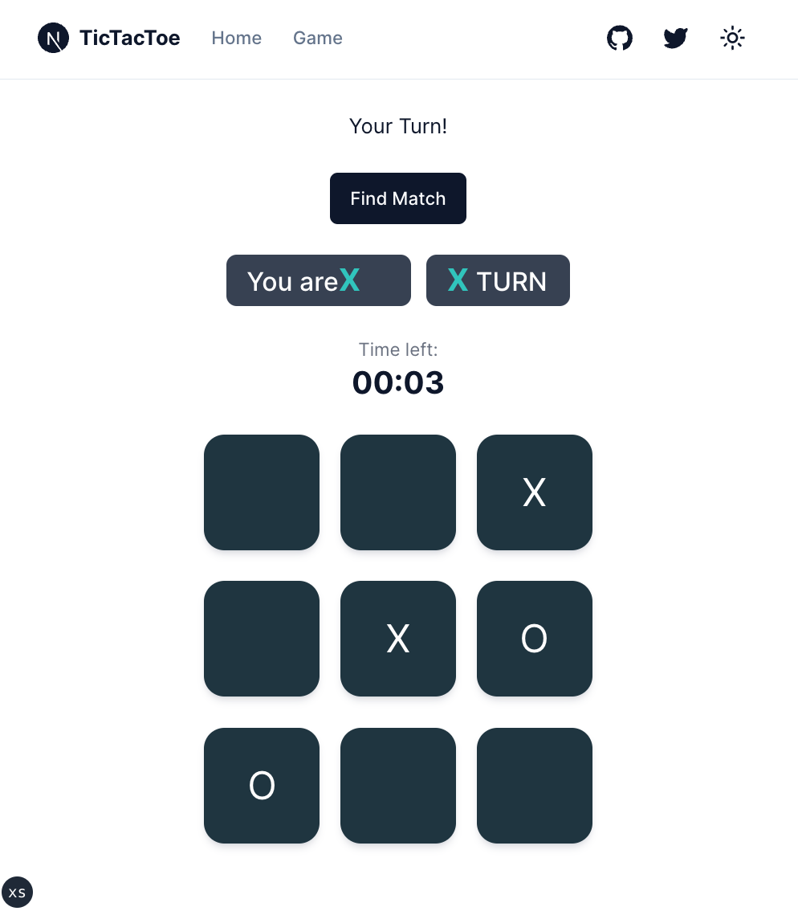

# xoxo-nextjs-nakama

A simple Tic-Tac-Toe/xoxo multiplayer online game build with nextjs and nakama

<h1 align="center">
  
</h1>

# tutorial

## nakama

- video
  - [Nakama Client Side Tutorial (js)](https://www.youtube.com/watch?v=nbvVNmwjOrA)
  - [Nakama Server Runtime Code Project Setup using TypeScript](https://www.youtube.com/watch?v=FXguREV6Zf8)
- document
  - [nakama server](https://heroiclabs.com/docs/nakama/concepts/multiplayer/authoritative/)

# Usage

## client

template from https://github.com/shadcn-ui/next-template

```
cd clien && cp .env.example .env.local
cd client && pnpm install
cd client && pnpm run dev
```

## server

template from https://github.com/heroiclabs/nakama-project-template

```
# if you want to yarn or pnpm, you should also change Dockerfile
cd server && npm install
cd server && docker-compose up

# when change source code, rebuild docker
cd server && docker-compose up --build
```

### port

- "7349": gRPC API server
- "7350": HTTP API server
- "7351": http://127.0.0.1:7351 : nakama console (web ui)
  - username and password can set in `/data/my-config.yml`

# deploy

```
# edit .env.production
cd client && pnpm run build && pnpm run start
cd server && docker-compose up -d
```
